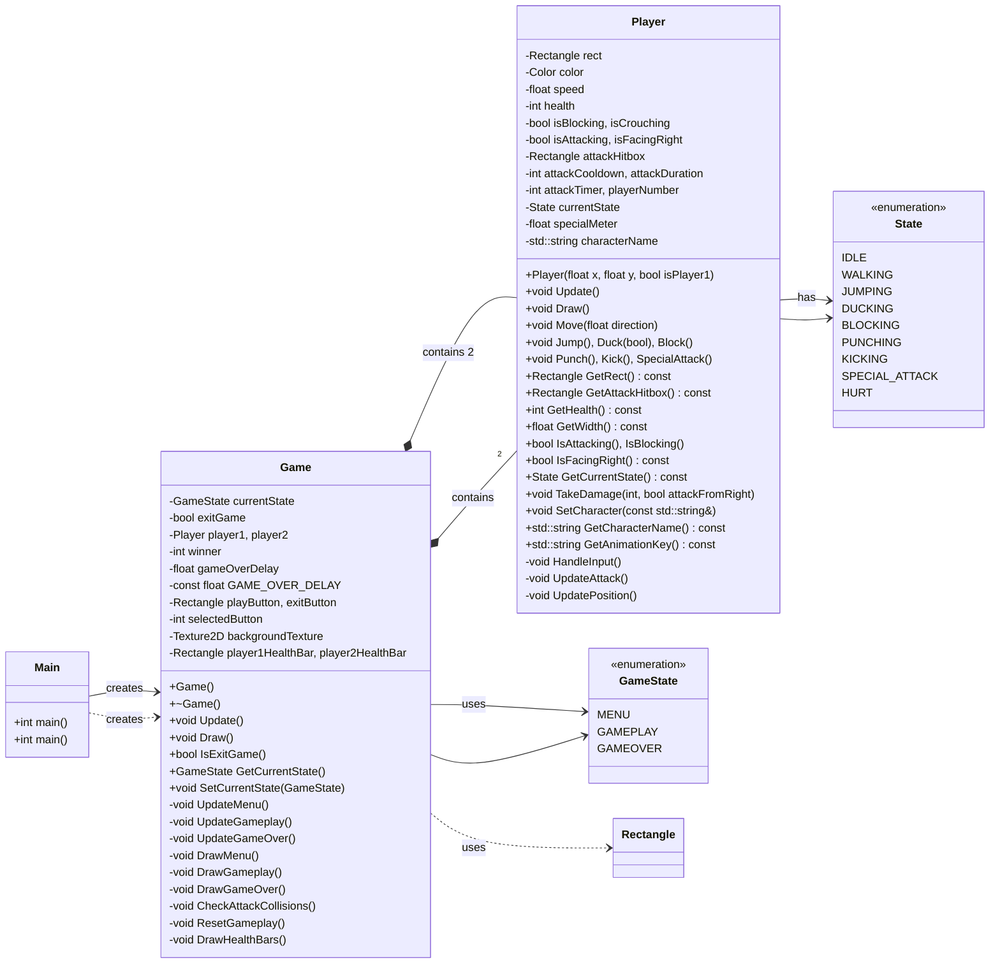

# OOP Project: 2D Fighting Game with Raylib

## TODO:

- [x] FEATURE: Implement Scene Switching
- [x] FEATURE: Implement Players
- [x] FEATURE: Implement Enemies
- [x] FEATURE: Implement Animation state machine
- [x] FEATURE: Implement Fighting mechanics
- [x] FEATURE: Animations and spritesheets
- [x] FEATURE: CI/CD pipeline
- [x] BUG: Player 0 (blue) wins every time
- [x] BUG: Blocking is buggy when crouching, refactor to have separate key
- [x] BUG: Duck-punch does not work
- [x] BUG: Duck attack not working
- [x] BUG: Some animation states not resetting to idle

### Members:

- Aayan Sultan (24K-2015)
- Zumair Shamsi (24K-2040)
- Devish Kumar (24K-2022)

### Project Work Division:

- Devish:
  - Setup movement controls
  - Setup Fonts and Menus
  - VSCode configurations
- Zumair:
  - Game Loop
  - Game Scenes
  - Window Creation
  - Main class architecture
- Aayan:
  - Setup player mechanics
  - Setup hitboxes
  - Setup Physics
  - Setup Fighting mechanics
  - CI/CD pipeline

### Media

- The main menu
  - 
- Start Timer
  - 
- Main level/arena
  - 
- Debug mode
  - 

### UML Diagram:

