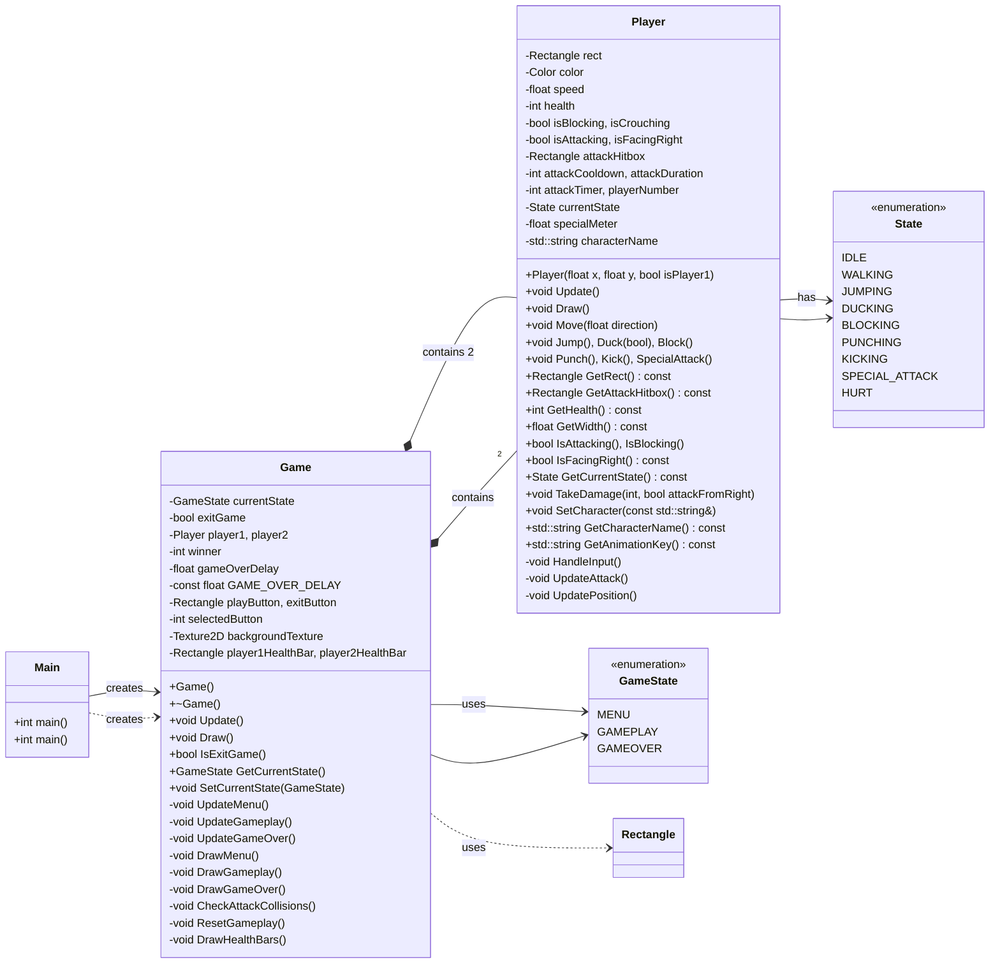

# OOP Project

## TODO:

- [x] FEATURE: Implement Scene Switching
- [x] FEATURE: Implement Players
- [x] FEATURE: Implement Enemies
- [ ] FEATURE: Implement Animation state machine
- [x] FEATURE: Implement Fighting mechanics
- [x] BUG: Player 0 (blue) wins every time
- [x] BUG: Blocking is buggy when crouching, refactor to have separate key
- [x] BUG: Duck-punch does not work
- [ ] FEATURE: when attacking top-left text should be removed.
- [ ] FEATURE: Duck attack not working
- [ ] FEATURE: Animations and spritesheets

### Members:

- Aayan Sultan (24K-2015)
- Zumair Shamsi (24K-2040)
- Devish Kumar (24K-????)

### Project Work Division:

- Devish:
	- Setup movement controls
	- Setup Fonts and Menus
- Zumair:
	- Game Loop
	- Game Scenes
	- Window Creation
- Aayan:
	- Setup player mechanics
	- Setup hitboxes
	- Setup Physics
	- Setup Fighting mechanics
	- Todo: Setup Animation state machine

### UML Diagram:

