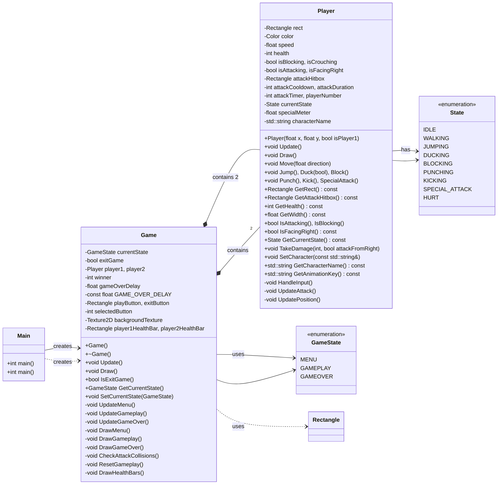

# OOP Project: 2D Fighting Game with Raylib

This is the repository for the final project of my CS-1004 Object Oriented Programming course, a street-fighter 2d clone made with raylib in cpp. This project was completed and presented on the 13th of May 2025.

### Personal Objectives Set
- Implement a 2D arcade fighter using Raylib.
- Demonstrate OOP concepts by creating reusable Player, Loader and Game classes.
- Achieve cross-platform compatibility (Windows, Linux, macOS).
- Set up CI/CD for automated builds and releases.

### Group Members and Work Division

- Aayan Sultan (24K-2015)
  - Setup player mechanics
  - Setup hitboxes
  - Setup Physics
  - Setup Fighting mechanics
  - CI/CD pipeline
- Zumair Shamsi (24K-2040)
  - Game Loop
  - Game Scenes
  - Window Creation
  - Main class architecture
- Devish Kumar (24K-2022)
  - Setup movement controls
  - Setup Fonts and Menus
  - VSCode configurations

### Media

- The main menu
  
  - 
- Start Timer
  
  - 
- Main level/arena
  
  - 
- Debug mode
  
  - 

- Demo Clip

https://github.com/user-attachments/assets/7cfad734-e43e-4d1b-888c-87083021f6af

### UML Diagram:

